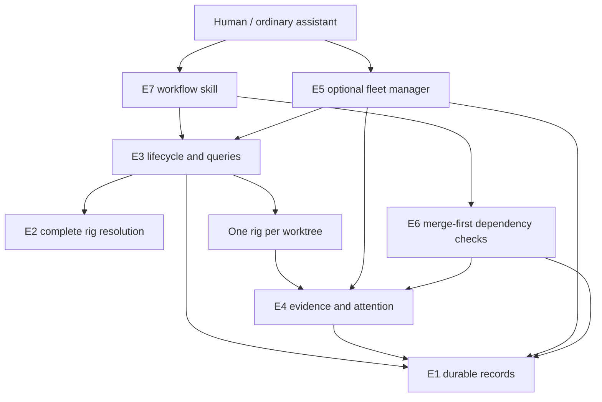

# Blueprint: independent job rigs and optional fleet management

Status: proposed design; no runtime implementation in this document.

## Goal

Let a human use any coding assistant to create, inspect, and communicate with independent job rigs instantiated from reusable templates. Each job owns one branch, one linked Git worktree, and one complete rig with its own lead, development seats, and verification seats. An optional fleet manager coordinates multiple jobs through durable records without replacing their leads or becoming a prerequisite for using them. Closing the initiating assistant session does not lose job identity, pending questions, or dependency state.

The user approved this goal and scope in the design conversation. The contracts below are proposed implementation interfaces, not claims about existing commands or OpenRig capabilities. Element specifications follow review of this blueprint; implementation follows those specifications through `blueprint-execute`.

## Acceptance criteria

- AC1 Any ordinary assistant session can request a job through lifecycle tools without a global lead or fleet manager running; the brief reaches that job's own lead.
- AC2 Each job creates one branch, one linked worktree under `<main-checkout>/.worktrees/<job>`, and one complete rig from a selected template; project hooks can override worktree placement.
- AC3 Two concurrent jobs have distinct rig, seat, generated-spec, and record identities, including repositories with identical folder names and job names that normalize to the same slug.
- AC4 A newly opened session can list jobs, inspect progress and verification evidence, identify pending attention requests, and relay an instruction to the correct job lead using durable identities.
- AC5 Interrupted setup can be inspected and continued without replacing existing rigs or discarding files; stop, resume, delete, and detach act only on recorded resources and preserve the existing branch-retention policy.
- AC6 Human decisions, permission prompts, failures, and progress are distinguishable; pending requests survive the absence or replacement of the fleet manager and are resolved only through an attributed response.
- AC7 Fleet management is optional, has one explicit active owner per configured fleet, supports release and handover, and does not grant permission to answer another seat's approval prompts or make reserved human decisions.
- AC8 Dependent implementation waits for the prerequisite to be merged by the human and made available on the recorded integration branch; independent investigation may proceed, and the dependent lead receives the exact integration revision and handoff evidence.
- AC9 Shared templates remain reusable across projects and both supported harnesses; project topology, seat models, and runtime choices do not silently change another project's rigs or an existing instance.
- AC10 Plans and status reads do not mutate project, rig, or permission state; tracked generated-file collisions fail before branch/worktree creation, and unsupported instruction preservation is reported rather than bypassed.
- AC11 Existing department rigs and external worktrees remain usable without automatic migration, stopping, renaming, or recreation.
- AC12 Documentation explains the complete workflow, ownership boundaries, and deferred environment isolation; parallel code work is not presented as proof that concurrent stacks are safe.

## Current integration points

| Existing path | Current responsibility | Required change |
|---|---|---|
| `bin/rig-job:39` `default_create_worktree` | Creates a real Git worktree in a sibling directory | Default to a locally excluded `.worktrees/` directory |
| `bin/rig-job:120` `cmd_start` | Creates branch/worktree, prepares, launches department rigs, briefs global lead | Launch one complete job rig and brief its recorded lead |
| `bin/rig-job:82` `find_worktree` | Discovers worktrees by basename | Use exact manifest identity for new jobs |
| `bin/rig-job:158` `cmd_finish` | Reconstructs teams and removes them before optional worktree cleanup | Use recorded rig identity and preserve actual stop failures |
| `bin/rig-job:24` `caller_may_spawn` | Allows human shells and optionally the global lead | Separate ordinary user-directed invocation from explicit fleet-seat lifecycle authority |
| `bin/rig-team:23` | Derives rig names from checkout and worktree basenames | Retain legacy use; new instances use durable unique identities |
| `lib/runtime-config.mjs:51` `resolveSeat` | Resolves a fixed set of machine-level department seats | Add complete-template/project resolution without altering legacy resolution |
| `lib/runtime-launch.mjs:48` `render` | Renders one department template beside its source | Add complete-rig rendering with correct relative resource resolution |
| `lib/runtime-launch.mjs:63` `permissions` | Verifies inventory before applying Claude preferences | Preserve verification, refusal behavior, and next-launch timing |
| `bin/rig-exclude` | Checks tracked collisions and writes local artifact exclusions | Separate read-only checks from writes; add root worktree exclusion |
| `lib/worktree-detach.mjs:11` `detach` | Preserves files while unregistering a selected worktree | Reuse after manifest identity validation |
| `agents/lead/orchestrator/guidance/role.md` | Global lead forbidden from inspecting project files | Preserve legacy role; add job-local lead and optional fleet role |
| `culture/CULTURE.md` | Routes every team through one global lead | Express independent job ownership and optional fleet coordination |
| `tests/job-lifecycle.test.mjs`, `tests/runtime-launch.test.mjs` | Temporary repositories and mocked rig lifecycle coverage | Extend with manifest recovery, concurrency, and complete-rig scenarios |

## Shared contracts

### C1 Identity and local storage

- `Id` is a lowercase UUID; `Time` is a UTC RFC 3339 timestamp; all stored filesystem paths are absolute.
- Configuration root retains `${OPENRIG_TEAMS_CONFIG:-${XDG_CONFIG_HOME:-$HOME/.config}/openrig-teams}`.
- State root is `${OPENRIG_TEAMS_STATE:-${XDG_STATE_HOME:-$HOME/.local/state}/openrig-teams}`. It contains `repositories/<repository-id>.json`, `jobs/<job-id>/manifest.json`, `jobs/<job-id>/rig/`, `jobs/<job-id>/attention/<request-id>.json`, and `fleets/<fleet-id>.json`.
- Repository record: `{version:1, id:Id, commonDir:string, mainCheckout:string, aliases:string[]}`. Canonical Git common-directory identity maps a repository to one record on this machine; basename and remote URL are not identity.
- Job names match `[a-z0-9][a-z0-9-]*`. Invalid names fail with a suggested normalized name rather than silently collapsing distinct inputs. One unfinished job may hold a given name per repository.
- Default checkout path is `<mainCheckout>/.worktrees/<job-name>`. Add `/.worktrees/` to the common repository's local exclusion block; never create checkouts inside `.git/worktrees/` or edit tracked `.gitignore` automatically.
- Rig names are `job-<job-name>-<job-id>`; lead addresses are `control-lead@<rig-name>`. Recorded pod/member addresses, not inferred department names, route every operation.
- Manifest and fleet writes are atomic and revision-checked under per-record locks. Startup reserves repository/job name and target path under a repository lock. Concurrent mutations return a conflict rather than overwriting each other. Files containing briefs and decisions are private to the user.

### C2 Job manifest

`JobManifest` is `{version:1, revision:integer, id:Id, repositoryId:Id, name:string, branch:string, base:{ref:string, commit:string}, worktree:string, template:{source:string, digest:string}, specPath:string, rigName:string, leadAddress:string, seats:Seat[], brief:string, lifecycle:Lifecycle, setup:Setup, outcome:Outcome, evidence:Evidence[], dependencies:Dependency[], integrationBranch:string, mergedCommit:string|null, fleetId:Id|null, createdAt:Time, updatedAt:Time}`.

- `Seat` is `{address:string, pod:string, member:string, runtime:"codex"|"claude-code", model:string|null, approval:"native"|"auto"}`; unsupported model selection fails during preflight rather than being ignored.
- `Lifecycle` is `preparing|running|stopped|failed|finished|detached|removed`; it describes managed resources, not whether the assignment succeeded.
- `Setup` is `{completed:("reserved"|"branch"|"worktree"|"prepared"|"rendered"|"launched"|"briefed")[], failedStep:string|null, error:string|null}`. A checkpoint is recorded only after verification; ambiguous outcomes are reconciled against Git/OpenRig before continuation.
- `Outcome` is `unassigned|working|waiting-human|waiting-dependency|verified|abandoned`. `verified` requires reviewer and tester evidence, and does not mean merged.
- `Evidence` is `{id:Id, kind:"review"|"test"|"progress"|"handoff", author:string, summary:string, reference:string|null, createdAt:Time}`. A reference identifies retrievable durable material; a transient terminal message is insufficient evidence storage.
- `Dependency` is `{jobId:Id, policy:"human-merge", state:"waiting"|"ready"|"blocked", requiredCommit:string|null, integrationCommit:string|null, handoffEvidenceIds:Id[]}`. Dependencies form an acyclic graph within one repository in the first version.
- OpenRig remains the authority for live rig/seat state and native queues. The manifest owns lifecycle checkpoints and the human-facing job index; it references native work items rather than duplicating their task state.
- Stored lifecycle plus live observation must both be shown. Unreachable daemon state is `unknown`, never proof that a rig is absent or safe to replace.

### C3 Configuration and rig template

- Existing shell project profiles retain machine paths and `profile_create_worktree`, `profile_prepare_worktree`, and `profile_remove_worktree` hooks. Hook execution occurs only in mutating operations; preview uses a declarative plan and does not source arbitrary project hooks as a supposed read-only guarantee.
- Optional project-owned `.openrig-teams/project.json` is `{version:1, template:string, integrationBranch:string, worktreeDirectory:string|null, seats:{"<pod>.<member>":{runtime?:"codex"|"claude-code", model?:string, approval?:"native"|"auto"}}, environment:{concurrentStacks:"unsupported"|"project-managed", notes:string}}`. Relative paths resolve from the main checkout, and external template sources require explicit configuration.
- Resolution order is reusable template defaults, machine runtime defaults, then explicit project seat overrides. Existing machine department overrides remain confined to legacy department templates. Native/managed harness permission restrictions always apply.
- A job stores its resolved seats and template digest at creation; later default changes affect new jobs only. Resume uses the recorded instance configuration.
- Initial complete template is `rigs/job/rig.yaml`: pod `control` with member `lead`, pod `dev` with member `builder`, pod `verify` with members `reviewer` and `tester`; all run in the job worktree. Lead delegates to builder; builder requests verification; findings return to builder; verified evidence returns to lead. Project templates may replace the topology while retaining exactly one designated lead.
- New job lead guidance is `agents/job/lead/`; fleet guidance is `agents/fleet/manager/`. Complete-template seats may reuse existing role resources only where those resources do not assume department addresses or a global lead.
- Generated specs and their referenced resources live under C1's instance directory with valid installed OpenRig resource resolution. The renderer validates the whole topology and selected-runtime artifact union before launch.

### C4 Lifecycle and query CLI

All commands in this contract are proposed additions or revised semantics of this repository's wrappers; they are not new upstream `rig` commands.

- `bin/rig-job start <project> <job> [--repo PATH] [--template PATH] [--branch REF] [--base REF] [--brief TEXT] [--depends-on JOB_ID ...] [--plan] [--json]` creates a new complete-rig job. Omitted brief leaves `outcome:unassigned`; it does not fabricate an assignment.
- `bin/rig-job list [--project PROJECT] [--json]` and `bin/rig-job status <job-id> [--json]` read persisted and observable live state without mutation.
- `bin/rig-job continue <job-id> [--plan] [--json]` reconciles interrupted setup and runs only unfinished safe stages. Profile preparation must declare repeatability in its element spec; an ambiguous nonrepeatable hook blocks with an actionable error.
- `bin/rig-job stop <job-id> [--plan] [--json]` snapshots/stops only the recorded rig, keeping branch, files, and manifest; `resume <job-id>` with the same options resumes a verified stopped instance, without re-rendering from changed defaults.
- `bin/rig-job finish <job-id> [--worktree|--detach-worktree] [--plan] [--json]` retires the recorded rig after the human's merge/abandon decision. No cleanup flag keeps files and Git registration. Delete refuses dirty/locked worktrees; detach preserves files. Both retain branches and job history. Actual stop failure prevents worktree cleanup.
- `bin/rig-job tell <job-id> --message TEXT [--json]` persists an instruction as a C5 request of kind `instruction`, addressed to the recorded lead, before attempting notification.
- `bin/rig-job report <job-id> --outcome OUTCOME --evidence-file PATH [--json]` accepts a JSON `Evidence[]` payload and validates the caller's recorded seat ownership. Only the job lead changes outcome; reviewer/tester evidence retains its original author.
- Exit codes: `0` success, `1` execution/connectivity failure, `2` invalid input/configuration, `3` identity/ownership/revision conflict, `4` unmet prerequisite. JSON output is `{ok:true,data:object|array}` or `{ok:false,error:{code:string,message:string,jobId:Id|null}}`; diagnostics go to stderr. List entries are `{job:JobManifest, live:{state:"running"|"stopped"|"absent"|"unknown", observedAt:Time, error:string|null}, attention:AttentionRequest[]}`; status returns one such entry.
- Preview validates without creating branches, checkouts, persistent state, generated specs, or permission changes. Existing branch/path/rig collisions refuse adoption. Recovery requires the matching manifest and verified resource ownership.
- Legacy name-based `start/finish --teams` remains an explicitly documented legacy path during transition; it cannot silently reinterpret existing department rigs as complete job rigs.

### C5 Durable attention and delivery

`AttentionRequest` is `{version:1, revision:integer, id:Id, jobId:Id, kind:"decision"|"permission"|"failure"|"progress"|"instruction", author:string, recipient:"human"|"lead", summary:string, detail:string, blocking:boolean, status:"open"|"answered"|"acknowledged", response:{author:string, body:string, createdAt:Time}|null, createdAt:Time, updatedAt:Time}`.

- `bin/rig-job attention <job-id> --kind KIND --summary TEXT --detail TEXT [--blocking] [--json]` creates a request. Job seats are restricted to their own job; permission requests name the seat and native prompt without answering it.
- `bin/rig-job answer <job-id> <request-id> --body TEXT [--json]` records the human-directed answer. Fleet ownership alone does not authorize answering a human decision. Caller identity is recorded by tools, not accepted from an arbitrary `--author` flag.
- `bin/rig-job acknowledge <job-id> <request-id> [--json]` records recipient receipt; decisions/permissions must have an answer first. Native permission resolution remains a separate harness operation and cannot be inferred from textual acknowledgement.
- Progress is nonblocking and not counted as unresolved human attention. Instructions target the lead; other kinds target the human. Unacknowledged records are discoverable without any manager running.
- Notification is best effort after durable creation; retries retain the same request ID. Recipients reconcile by ID before acting. No exactly-once delivery claim is made. Session closure or failed messaging never deletes requests or falsely marks them answered.

### C6 Optional fleet ownership

`FleetRecord` is `{version:1, revision:integer, id:Id, name:string, jobIds:Id[], managerAddress:string|null, owner:{token:Id, sessionId:string, address:string, acquiredAt:Time, heartbeatAt:Time, expiresAt:Time}|null}`.

- `bin/rig-fleet create <name> [--json]`, `add <fleet-id> <job-id> [--json]`, and `status <fleet-id> [--json]` manage membership and aggregate C4/C5 records. Status does not require an owner.
- `bin/rig-fleet take <fleet-id> --seat ADDRESS [--json]` verifies a live designated fleet seat and caller session, acquires exclusive ownership, and returns the owner token. `heartbeat <fleet-id> --token TOKEN`, `release <fleet-id> --token TOKEN`, and `handover <fleet-id> --token TOKEN --seat ADDRESS` are explicit mutations; all support `--json`.
- Ownership expires after 120 seconds without renewal; agents renew at least every 30 seconds while actively coordinating. Expiry does not stop jobs. Handover invalidates the previous token atomically; an absent/expired owner leaves requests queued until someone explicitly takes ownership.
- Fleet-coordinating writes require a current owner token; tools reject stale owners. Ordinary human-directed job queries/instructions do not require fleet ownership.
- There is one stable designated manager seat address per fleet; seat replacement is an explicit handover, not an automatic rewrite. Lead requests are stored by job ID regardless of notification destination.
- An ordinary assistant can inspect/relay without becoming a seat. Occupying fleet management requires a verified OpenRig seat. Attaching an existing external session is an integration question, not an assumed capability; a supported managed-seat handover is the fallback.
- Fleet lifecycle spawning is a separately saved machine authorization, disabled by default for seats. Job seats cannot create sibling jobs. No role may approve another seat's permission prompts or merge code.

### C7 Dependency readiness

- `bin/rig-job merged <job-id> --commit REV [--json]` is a human-directed declaration. Tools verify the prerequisite's recorded branch tip is contained in the declared commit and that commit is on the recorded integration branch. Squash/rebase merges that fail ancestry verification remain blocked pending an explicit human-attested mapping recorded as handoff evidence; they are never guessed equivalent.
- `bin/rig-job dependency-check <job-id> [--json]` verifies each recorded prerequisite has merge evidence and records `requiredCommit`, `integrationCommit`, and handoff evidence only after verification. It uses existing local refs; no implicit fetch, merge, rebase, or cherry-pick.
- Readiness releases dependent implementation only when its worktree HEAD contains the required integration revision. A pre-created worktree behind that revision remains waiting until the human authorizes its update through project tooling. Dirty work is preserved.
- Until ready, the lead may delegate independent investigation with an explicit boundary; it cannot implement against an unmerged assumed contract. Abandoned prerequisites block dependents. Cycle/unknown-job/cross-repository dependencies fail validation.
- The fleet manager may notify and request a check; readiness is derived by tools and does not depend on an agent saying “done.”

## Elements

### E1 job records — state library — new `lib/job-state.mjs`

- Serves: AC3, AC4, AC5, AC6, AC7, AC8.
- Responsibility: Persist and validate repository, job, request, and fleet records with exclusive reservation and revision checks.
- Needs: C1, C2, C5, C6; `lib/runtime-config.mjs:85` `writeAtomic` as an existing atomic-write reference.
- Produces: C1 local records and validated C2/C5/C6 values.
- Interface: `readJob(id): JobManifest`, `listJobs(repositoryId|null): JobManifest[]`, `createJob(manifest): JobManifest`, `updateJob(id, expectedRevision, changes): JobManifest`; corresponding record operations obey C1 revision/locking rules.
- Rules: IDs and paths are validated; unavailable live state never rewrites persisted ownership; conflicts preserve both files and the current record; retained history survives worktree cleanup.
- Verified by: Temporary-state tests for duplicate reservations, concurrent revision conflicts, interrupted writes, and history retention.
- Open: none.

### E2 complete rig configuration — renderer — modify `lib/runtime-config.mjs`, `lib/runtime-launch.mjs`; new `rigs/job/rig.yaml`, `agents/job/lead/`

- Serves: AC1, AC2, AC3, AC9, AC10, AC11.
- Responsibility: Resolve a reusable complete topology and render a validated immutable instance configuration.
- Needs: C1, C2, C3; existing schema loading in `lib/runtime-launch.mjs:18` and approval checks in `lib/runtime-launch.mjs:63`.
- Produces: C2 resolved seats and C1 instance rig resources from C3.
- Interface: `resolveJobRig(projectPath, templatePath, machineSettings): {templateDigest:string,seats:Seat[],leadPod:string,leadMember:string}` and complete-rig render/preflight entry points specified against C3/C4.
- Rules: Invalid topology/model/instruction collisions fail before job creation; generated references remain valid outside shared template folders; approval timing and native refusal remain explicit; legacy templates keep their behavior.
- Verified by: Installed-schema validation of complete/mixed templates and tests for project separation, frozen resume configuration, and generated-resource paths.
- Open: Verify installed runtime model fields, generated instruction preservation, and relocated resource resolution before writing this element's implementation spec; retain refusal where preservation is unsupported.

### E3 job lifecycle — CLI and worktree integration — modify `bin/rig-job`, `bin/rig-exclude`; new `lib/job-lifecycle.mjs`

- Serves: AC1, AC2, AC3, AC4, AC5, AC10, AC11.
- Responsibility: Execute and reconcile only the recorded job's branch, worktree, rig, and initial brief.
- Needs: E1, E2; C1–C4, C5 for persisted briefs/instructions; existing lifecycle functions and `lib/worktree-detach.mjs:11`.
- Produces: C4 command results, C2 checkpoints, one complete rig, and a default locally excluded worktree.
- Interface: C4 lifecycle/query commands; `bin/rig-exclude <project> --check [--runtime codex|claude-code|both]` is the new read-only collision preflight.
- Rules: Preflight precedes branch/worktree changes; plans execute no arbitrary profile hooks; failure leaves inspectable recoverable state; stop failures block cleanup; no adoption of unrelated branches or rigs; legacy mode stays explicit.
- Verified by: Two-job temporary Git scenarios, collision cases, injected failures at every setup stage, recovery without duplicate launch/brief, and dirty/locked cleanup preservation.
- Open: Define a declarative preview bridge and repeatability metadata for existing shell hooks during element specification; unclassified hooks cannot be retried automatically.

### E4 attention and reporting — job communication tools — new `lib/job-attention.mjs`, modify `bin/rig-job`

- Serves: AC4, AC6, AC7.
- Responsibility: Persist attributed job evidence, human requests, responses, and lead instructions before attempting delivery.
- Needs: E1; C2, C4 report/tell/query interfaces, C5; recorded lead identity supplied by E3 at runtime.
- Produces: C5 requests, C2 evidence/outcome updates, and retrievable notification status.
- Interface: C4 `tell/report` and C5 attention/answer/acknowledge commands.
- Rules: Failed delivery retains requests; repeats use request IDs; job-seat ownership is checked; reserved human decisions and native approvals remain human-controlled; verified outcome requires distinct reviewer/tester evidence.
- Verified by: Manager-offline creation, new-session query, duplicate delivery, unauthorized response, and verified-without-evidence refusal tests.
- Open: Verify installed native queue/message identifiers and choose durable evidence references in the element spec; do not invent upstream event APIs.

### E5 optional fleet management — CLI and agent role — new `bin/rig-fleet`, `lib/fleet-manager.mjs`, `agents/fleet/manager/`

- Serves: AC4, AC6, AC7.
- Responsibility: Aggregate durable job information and coordinate through an explicitly owned optional manager seat.
- Needs: E1, E4; C4 status, C5, C6; E3 supplies observable live inventory.
- Produces: C6 ownership/membership records, fleet status, and routed attention notifications.
- Interface: C6 fleet commands; fleet role follows C5/C6 and invokes C4 tools rather than raw lifecycle assembly.
- Rules: Job operation continues without ownership; only the current token coordinates fleet writes; expiry/handover rejects stale owners; permission to spawn is separate; ordinary assistant reads require no seat takeover.
- Verified by: Competing take, owner expiry, handover, stale-token rejection, manager disappearance, and complete operation without a fleet manager.
- Open: Verify installed OpenRig seat takeover/handover and caller identity; external-session attachment is optional and must not block managed-seat fleet operation.

### E6 merge-first dependencies — readiness tools — new `lib/job-dependencies.mjs`, modify `bin/rig-job`

- Serves: AC8.
- Responsibility: Gate dependent implementation on human merge evidence and an available integration revision.
- Needs: E1, E4; C2, C7; C4 returns job status and evidence.
- Produces: C2 dependency state and C7 actionable handoff results consumed by job leads and E5.
- Interface: C7 `merged/dependency-check` commands and dependency validation for C4 start.
- Rules: Completion alone never releases work; ancestry and dependent HEAD are checked; squash/rebase ambiguity requires recorded human attestation; no automatic code integration; cycles and abandoned prerequisites remain blocked.
- Verified by: Unmerged verified job, merged-but-stale dependent, ready dependent, dirty checkout preservation, squash ambiguity, and cycle rejection scenarios.
- Open: none.

### E7 workflow guidance and compatibility — skills and documentation — new `skills/job-rigs/SKILL.md`; modify `README.md`, `AGENTS.md`, `docs/project-profile.md`, `culture/CULTURE.md`

- Serves: AC1, AC4, AC7, AC9, AC10, AC11, AC12.
- Responsibility: Teach any assistant the same mechanical tool workflow and explain legacy versus complete-job operation.
- Needs: C1–C7; E2–E6 command behavior and documented integration limits.
- Produces: Project-owned workflow skill, current usage examples, migration boundaries, and deferred-environment problem statement.
- Interface: Natural requests map to C4–C7; skill installation remains explicit and does not modify unrelated global harness configuration.
- Rules: Job leads may inspect their own project; fleet manager routes requests without replacing leads; no automatic migration; no claims of safe concurrent stacks; retain human ownership of commits, merges, and cleanup authorization.
- Verified by: Documentation walkthrough of two jobs, closing/reopening the assistant, manager takeover, a pending human decision, and a merge-gated dependency using the implemented tools.
- Open: none.

## Wiring

## Build order

- Milestone 1: Specify and build E1 and E2, then E3; demonstrate one complete job with its own lead under `.worktrees/`, queryable without a global lead.
- Milestone 2: Exercise E3 concurrency and collision checks with two jobs and same-basename repositories; neither job changes the other's resources.
- Milestone 3: Complete E3 interruption recovery and stop/resume/delete/detach checks; injected failures preserve recoverable records and files.
- Milestone 4: Build E4, then E5; demonstrate pending questions with no manager, followed by exclusive takeover and handover.
- Milestone 5: Build E6; demonstrate independent investigation while blocked and implementation released only after human merge and dependent revision availability.
- E7 accompanies each milestone, with the final end-to-end walkthrough after E6. E4 and E6 specifications may proceed independently once E1 contracts are stable; E5 consumes E4.
- Each element receives a detailed specification before implementation. Open integration questions must be resolved or narrowed to an explicit supported fallback in that specification; use `blueprint-execute` once specs exist.

## Decisions

- A complete job rig is the default new abstraction; existing department rigs remain a legacy option during transition.
- Fleet coordination data persists independently of an agent; a permanent global lead is unnecessary.
- A job lead owns its assignment and worktree context; an optional manager owns cross-job monitoring and routing.
- Stable UUIDs and exact manifests replace folder-name inference for new jobs.
- Instance state lives outside worktrees so removal cannot erase questions, ownership, or evidence.
- `.worktrees/` is the default checkout location, locally excluded; project worktree tooling may override placement.
- Project-owned topology is separate from machine paths, credentials, and native permission restrictions; resolved instances are frozen.
- Human merge is the dependency integration policy; agents never infer that a completed branch is already available to another worktree.
- Scripts own mechanical state transitions; skills and agents interpret assignments and use those scripts.
- No automatic changes to existing rigs, profiles, running services, or global permission settings accompany adoption.

## Risks and unknowns

- E2: Installed OpenRig model fields and managed instruction behavior must be verified for the selected version. Unsupported tracked-target preservation remains a preflight blocker.
- E2/E3: Current relative agent references and culture placement cannot simply be copied to a state directory; validate a relocatable resource bundle before launch.
- E3: Shell profiles are executable configuration. A true read-only preview needs declarative data; existing hooks cannot be assumed safe or repeatable because they conventionally call `run`.
- E3/E4: Launch or notification may succeed before a checkpoint write fails. Reconcile actual state and deduplicate delivery rather than promising transactional external commands.
- E5: Reading `OPENRIG_SESSION_NAME` alone is not a security boundary. Verify caller identity through supported runtime mechanisms; tokens and saved spawn policy coordinate ownership without overriding native permissions.
- E5: Directly attaching an already-open Codex conversation to an OpenRig seat is unverified. Managed-seat takeover is an acceptable initial route, with ordinary assistant querying always available.
- E6: Squash/rebase integration breaks simple ancestry proofs. Preserve explicit human-attested mappings and do not silently weaken readiness checks.
- E7 / deferred stage: Worktrees share machine CPU, memory, ports, databases, credentials, and external resources. Record environment capability and prevent unsupported concurrent stack claims. Port allocation, isolated databases, resource budgets, scheduling, and admission control are a later design, not part of these milestones.
- Validation limit: Automated temporary-repository and mocked-daemon tests establish lifecycle contracts; real multi-rig instruction projection, native approvals, seat handover, and human notification require a separately authorized live validation before claiming operational completion.
